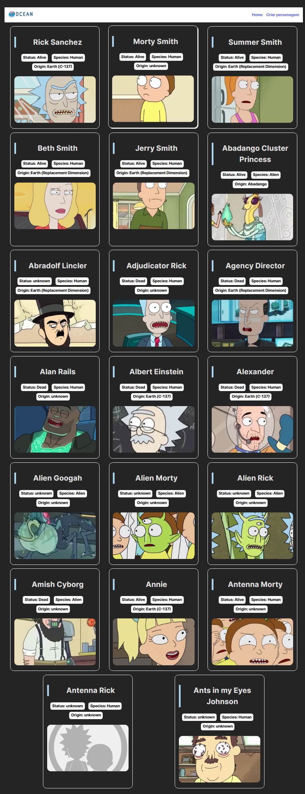
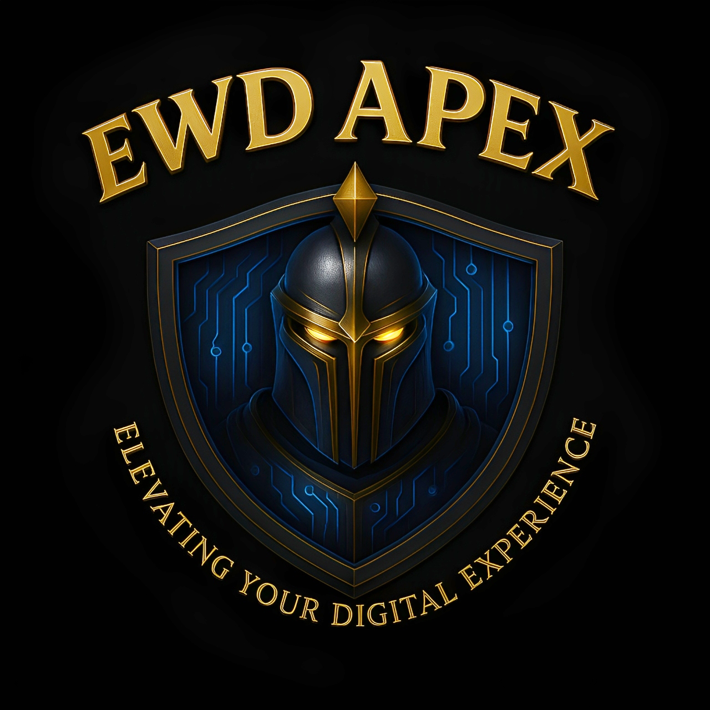
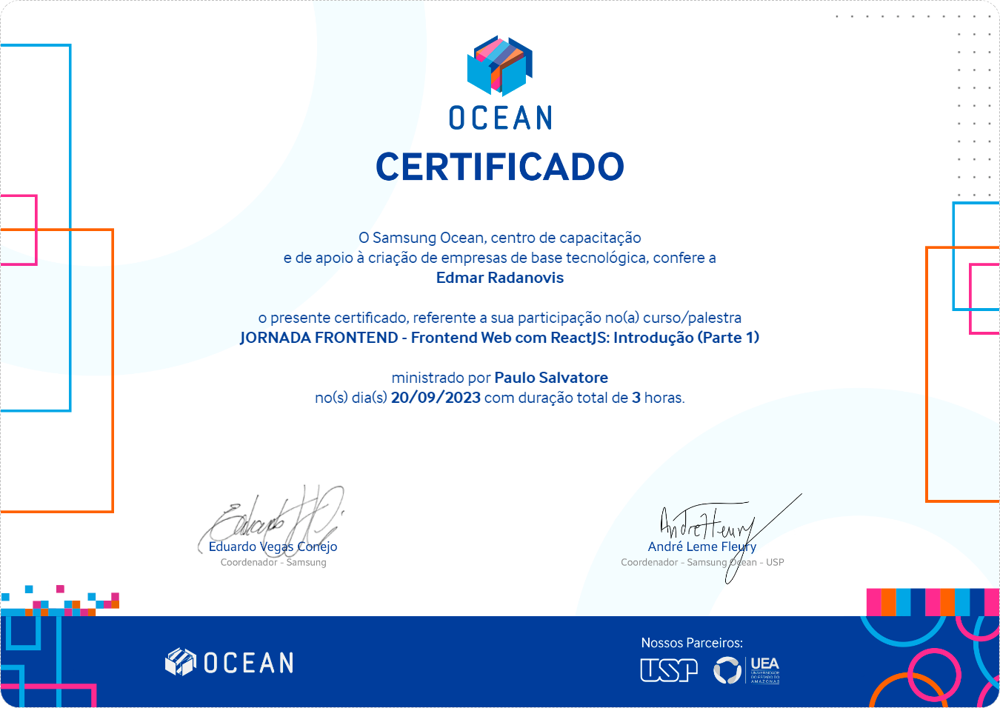
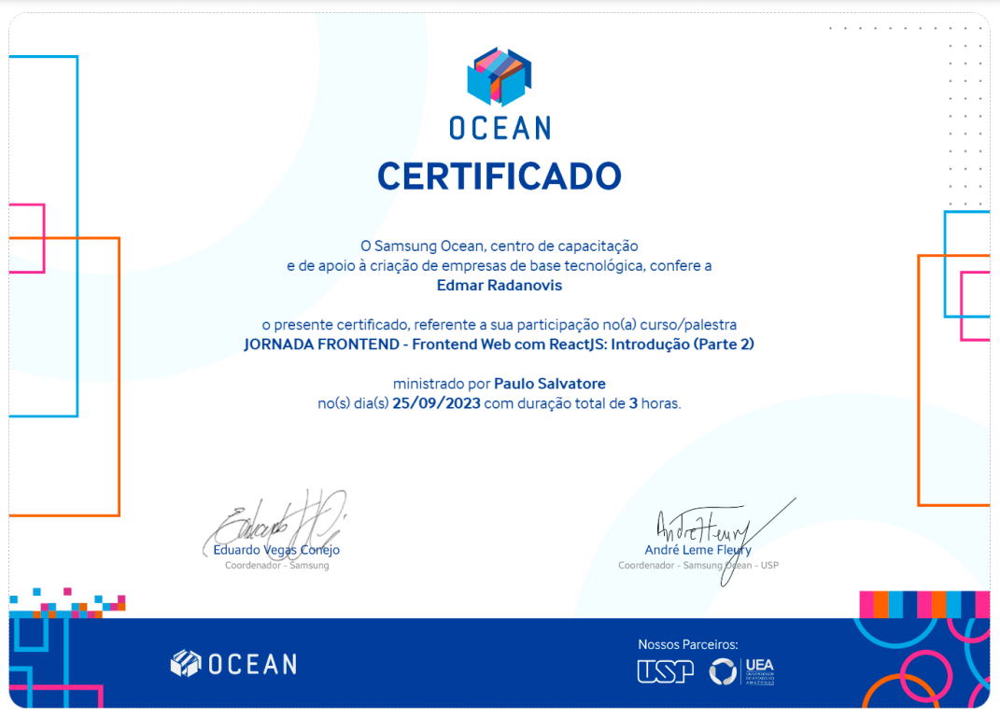
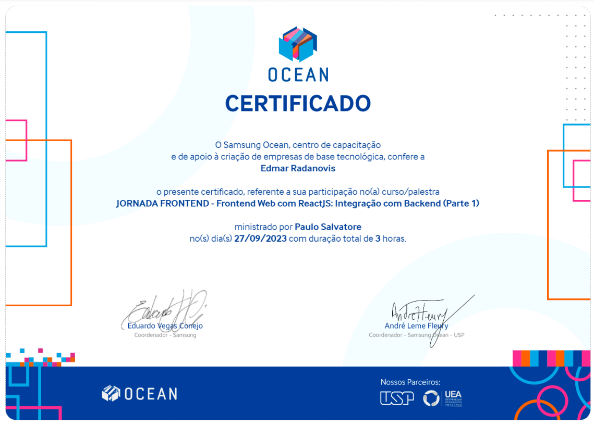
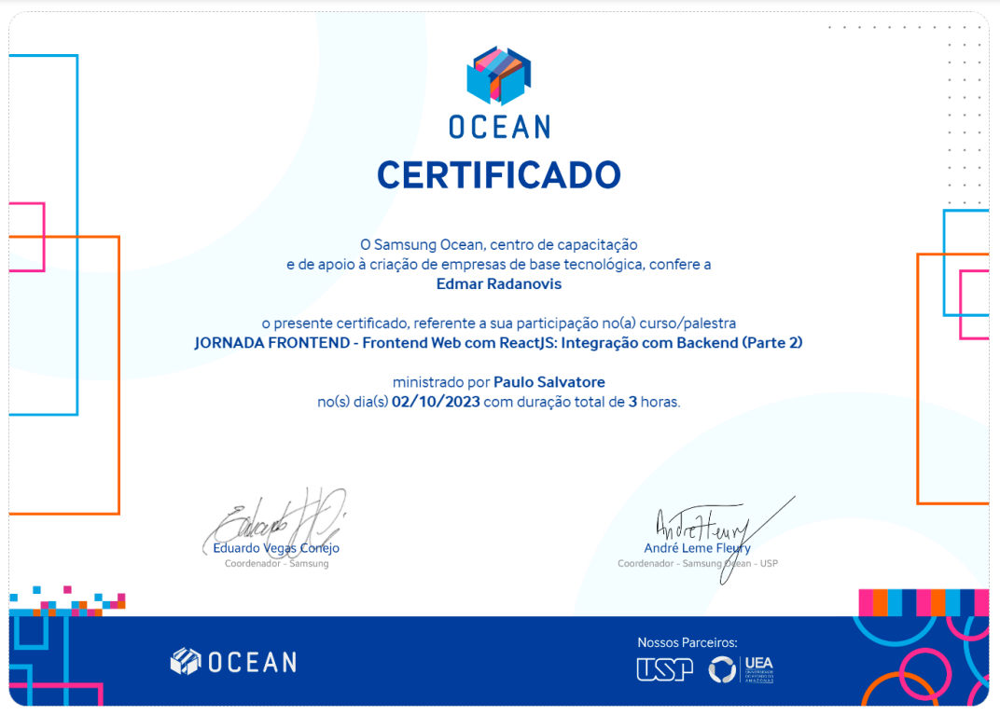
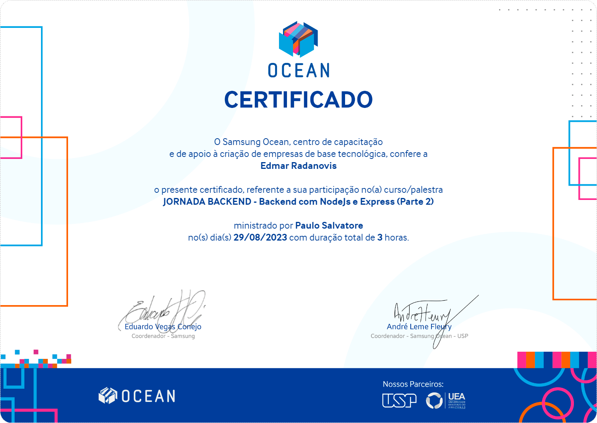
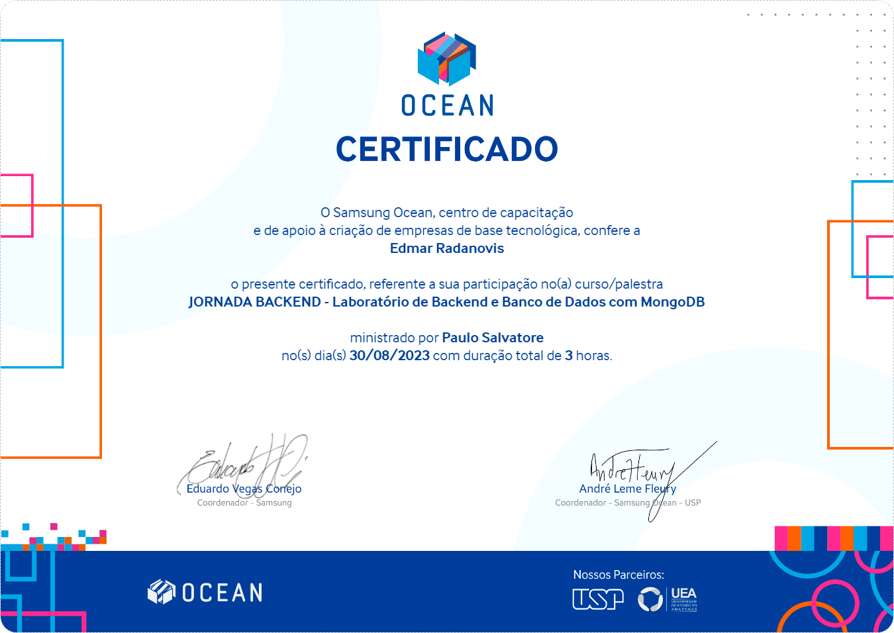

# Project to consolidate Fullstack concepts with M.E.R.N.

## Academic project for delivery

### Samsung Ocean Tech Journey

Taught by Paulo Salvatore - Technology Education Faculty at Samsung Ocean.
<br>

Below is the result of the completed project:
<br>

> 🎯 Objective:
>
> - Develop a full-stack application to consolidate the concepts of the M.E.R.N. stack (MongoDB, Express.js, React, Node.js) learned during the Samsung Ocean Jornada FullStack course. The project implements a backend with a [RESTful API with Express](https://expressjs.com/en/guide/routing.html) to manage a collection of "heroes" in [MongoDB](https://www.mongodb.com/) and a [React](https://react.dev/) frontend using [Vite](https://vite.dev/) and [CSS](https://developer.mozilla.org/pt-BR/docs/Web/CSS) to create an interactive gallery to manage heroes ✅.

> - This project consolidated my knowledge in building RESTful APIs with Express and MongoDB, handling asynchronous data fetching in React and creating a responsive user interface with Vite and CSS.<br>
>   A key highlight was integrating an external API for dynamic character rendering and CRUD operations, enhancing my skills in frontend development, API consumption, and full-stack architecture. 🔗.<br>
>   The modular structure of the components (Card, Header, Tag) simplified the development process, making the project especially enjoyable to build.
>   <br>

### 🚀 Features

- Hero gallery listing from Rick and Morty API
- Full CRUD operations
- MongoDB database integration
- Responsive UI built with Vite + CSS
- Backend and frontend deployment with Render
  <br>

<p align="center">

</p>
<br>
<br>
<div align="center">
 <a href="https://samsungoceanjourney.onrender.com/" >Click here to try it out .. thanks for your interest!</a>
 <p>( 🖱️ Ctrl + click to open in a new tab )</p>
</div>
 <br>
 <br>

### Adjustments and improvements

The project was fully completed and some of the resources used were:

- [x] **Frontend**:&nbsp;&nbsp;&nbsp;&nbsp;&nbsp;&nbsp;[](https://reactjs.org)&nbsp;&nbsp;[](https://vite.dev)&nbsp;&nbsp;[](https://developer.mozilla.org/en-US/docs/Web/HTML) &nbsp;&nbsp;[](https://developer.mozilla.org/en-US/docs/Web/CSS)&nbsp;&nbsp;

- [x] **Backend**:&nbsp;&nbsp;&nbsp;&nbsp;&nbsp;&nbsp;&nbsp;[](https://nodejs.org)&nbsp;&nbsp;&nbsp;&nbsp;&nbsp;&nbsp;[](https://developer.mozilla.org/en-US/docs/Web/JavaScript)&nbsp;&nbsp;&nbsp;&nbsp;&nbsp;&nbsp;[](https://expressjs.com)&nbsp;&nbsp;&nbsp;&nbsp;&nbsp;&nbsp;[](https://github.com/remy/nodemon)

- [x] **Database**:&nbsp;&nbsp;&nbsp;&nbsp;&nbsp;&nbsp;[](https://www.mongodb.com)

- [x] **Integration**:&nbsp;&nbsp;&nbsp;[](https://rickandmortyapi.com)

- [x] **Testing**:&nbsp;&nbsp;&nbsp;&nbsp;&nbsp;&nbsp;&nbsp;&nbsp;&nbsp;&nbsp;[](https://jestjs.io)&nbsp;&nbsp;&nbsp;&nbsp;&nbsp;&nbsp;[](https://testing-library.com/docs/react-testing-library/intro)

- [x] **Hosting and Deployment**:&nbsp;&nbsp;&nbsp;&nbsp;&nbsp;&nbsp;[](https://render.com)&nbsp;&nbsp;&nbsp;&nbsp;&nbsp;&nbsp;[](https://netlify.com)

- [x] **Planning**:&nbsp;&nbsp;&nbsp;&nbsp;&nbsp;&nbsp;[](https://miro.com)
      <br>

#### ⚙️ Steps for the project

✔️ - Planning: Access the `Miro board` to review your project planning <br>
✔️ - Configure the environment:

- [x] Install `Node.js` (version >=16).
- [ ] If you choose, clone the repository:

```bash
git clone https://github.com/ed-radanovis/Samsung_Ocean_Jornada_FullStack.git
```

- [ ] Navigate to the project folder: `cd Samsung_Ocean_Jornada_FullStack` or the folder you created and named.

---

#### 💻 Backend

✔️ - Navigate to the backend folder : `cd backend`.<br>
✔️ - Initialize the project: `npm init -y` .<br>
✔️ - Install the dependencies:

```bash
npm install express mongodb
npm install --save-dev nodemon
```

---

#### 💾 Database

✔️ - Configure MongoDB Atlas:

- [x] &nbsp;&nbsp;&nbsp;Create a cluster in `MongoDB Atlas`
- [x] &nbsp;&nbsp;&nbsp;Add the IP `0.0.0.0/0` for access<br>
  > 📝 Note: Use 0.0.0.0/0 for testing only; configure specific IPs in production.

✔️ - Create your environment configuration:&nbsp;&nbsp;&nbsp;&nbsp;&nbsp;&nbsp;🔐

> ℹ️ An example environment file is available at: /backend/.env.example.
> Use it to create your own .env file with sensitive credentials.

- [x] &nbsp;&nbsp;&nbsp;Inside the `/backend` folder, create a `.env` file:

```bash
cp backend/.env.example backend/.env
```

- [x] &nbsp;&nbsp;&nbsp;Open the .env file and insert your MongoDB credentials:

```env
MONGODB_URI=mongodb+srv://your connection string
PORT=2000
```

> ⚠️ Important: Do not commit your real .env file to version control.
> Instead, use a .env.example file to share configuration instructions without exposing sensitive data.<br>

✔️ - Example of .env.example :

```env
# MongoDB connection string from MongoDB Atlas
MONGODB_URI=mongodb+srv://<username>:<password>@<cluster>.mongodb.net/<dbname>?retryWrites=true&w=majority

# Port on which the backend server will run
PORT=2000
```

✔️ - Start the backend: `npm run dev`.<br>
✔️ - Test the API on `http://localhost:2000` (e.g. `curl http://localhost:2000/heroes`).

---

#### 🖥️ Frontend

✔️ - Navigate to the frontend folder: `cd frontend`.<br>
✔️ - Initialize the project: `npm install` .<br>
✔️ - Start the development server: `npm run dev`. <br>
✔️ - Access the application at `http://localhost:5173`. <br>

---

#### 🔗 Integration Front + Backend

✔️ - Add CORS to the backend at /backend/index.js:

```javascript
const cors = require("cors");
app.use(cors({ origin: "http://localhost:5173" }));
```

✔️ - Install: `npm install cors` .<br>
✔️ - Update `/frontend/src/App.jsx` to consume the API from the backend:

```javascript
async function loadDataApi() {
  const response = await fetch("http://localhost:2000/heroes");
  const itens = await response.json();
  setItens(itens);
}
```

✔️ - Test the integration on `http://localhost:5173`

---

#### 🔬 Testing

✔️ - Backend:

- [x] &nbsp;&nbsp;&nbsp;Install Jest: `npm install --save-dev jest supertest` .
- [x] &nbsp;&nbsp;&nbsp;Create tests in `/backend/tests/heroes.test.js` :

```javascript
const request = require("supertest");
const app = require("../index");
test("GET /heroes", async () => {
  const res = await request(app).get("/heroes");
  expect(res.status).toBe(200);
});
```

- [x] &nbsp;&nbsp;&nbsp;Run: `npm test` .

✔️ - Frontend:

- [x] &nbsp;&nbsp;&nbsp;Install React Testing Library: `npm install --save-dev @testing-library/react` .
- [x] &nbsp;&nbsp;&nbsp;Create tests in `/frontend/src/__tests__/Card.test.js` :

```javascript
import { render, screen } from "@testing-library/react";
import Card from "../components/Card/Card";
test("renders hero name", () => {
  const item = { name: "Teste" };
  render(<Card item={item} />);
  expect(screen.getByText("Teste")).toBeInTheDocument();
});
```

- [x] &nbsp;&nbsp;&nbsp;Run: `npm test` .

---

#### 🌐 Deploy:

✔️ - Backend in Render:

- [x] &nbsp;&nbsp;&nbsp;Go to [Render](https://render.com)
- [x] &nbsp;&nbsp;&nbsp;Create a new web service, connect the repository `https://github.com/repository-created-by-you`.
- [x] &nbsp;&nbsp;&nbsp;Configure environment variables: `MONGODB_URI` , `PORT=2000` .
- [x] &nbsp;&nbsp;&nbsp;Deploy and access: `https://your-chosen-address.com` .

✔️ - Frontend in Render (Default choice - free):

- [x] &nbsp;&nbsp;&nbsp;Go to [Render](https://render.com).
- [x] &nbsp;&nbsp;&nbsp;Create a new static site, connect the repository `https://github.com/repository-created-by-you`.
- [x] &nbsp;&nbsp;&nbsp;Select the `/frontend` folder as the root directory.
- [x] &nbsp;&nbsp;&nbsp;Configure the environment variable `VITE_BACKEND_URL` with the backend URL (ex.: `https://your-chosen-address.com`).
- [x] &nbsp;&nbsp;&nbsp;Deploy and access the generated URL.

❓ - Frontend in Netlify (Optional - free with reservations):

- [ ] &nbsp;&nbsp;&nbsp;Go to [Netlify](https://netlify.com).
- [ ] &nbsp;&nbsp;&nbsp;Import the repository `https://github.com/repository-created-by-you`.
- [ ] &nbsp;&nbsp;&nbsp;Select the `/frontend` folder as the root directory.
- [ ] &nbsp;&nbsp;&nbsp;Configure the environment variable `VITE_BACKEND_URL` with the backend URL.
- [ ] &nbsp;&nbsp;&nbsp;Deploy and access the generated URL.

> 📝 Note: The project uses MongoDB Atlas with the SamsungOceanProject_JornadaBackEnd database and heroes collection.The frontend currently consumes the Rick and Morty API, with partial integration to the backend. Project planning was done using Miro. <br> > <br>

<h4 align="center">
  🤝 Collaborators
<h4/>
<table align="center"
  <tr>
    <td align="center">
      <a href="https://www.linkedin.com/in/edmar-radanovis-0130b611a/">
        <br>
      <sub>
        <b>Edmar Radanovis</b>
      </sub>
      </a>
    </td>
    <td align="center">
      <a href="https://oceanbrasil.com/">
        <br>
      <sub>
        <b>Samsung Ocean Tech</b>
      </sub>
      </a>
    </td>
  </tr>
</table>
<br>

<h4 align="center">
  🥇 Certificates
<h4/>
Frontend :
<table align="center">
  <tr>
    <td align="center">
      <br>
    </td>
    <td align="center">
      <br>
    </td>
    <td align="center">
      <br>
    </td>
    <td align="center">
      <br>
    </td>
  </tr>
</table>

Backend :

<table align="center">
  <tr>
    <td align="center">
      <br>
    </td>
    <td align="center">
      <br>
    </td>
    <td align="center">
      <br>
    </td>
    <td align="center">
      <br>
    </td>
  </tr>
</table>

[⬆ Back to top](#project-to-consolidate-fullstack-concepts-with-mern)

